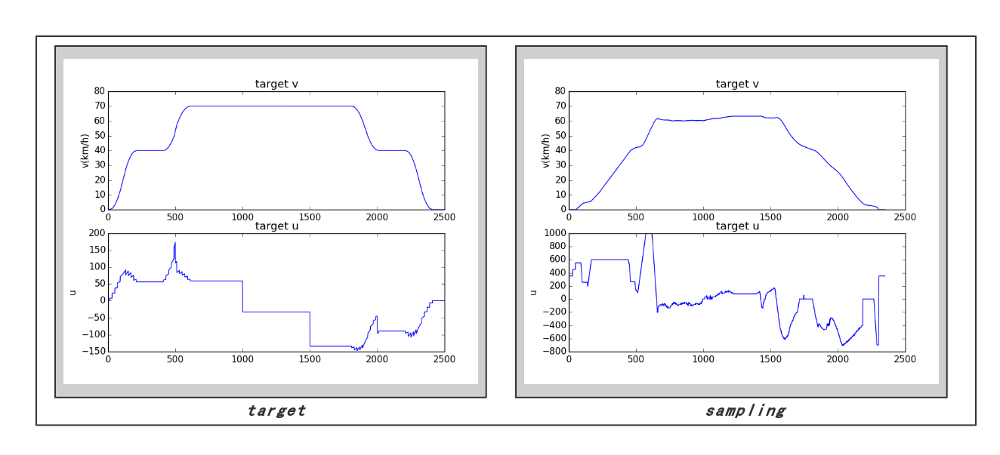
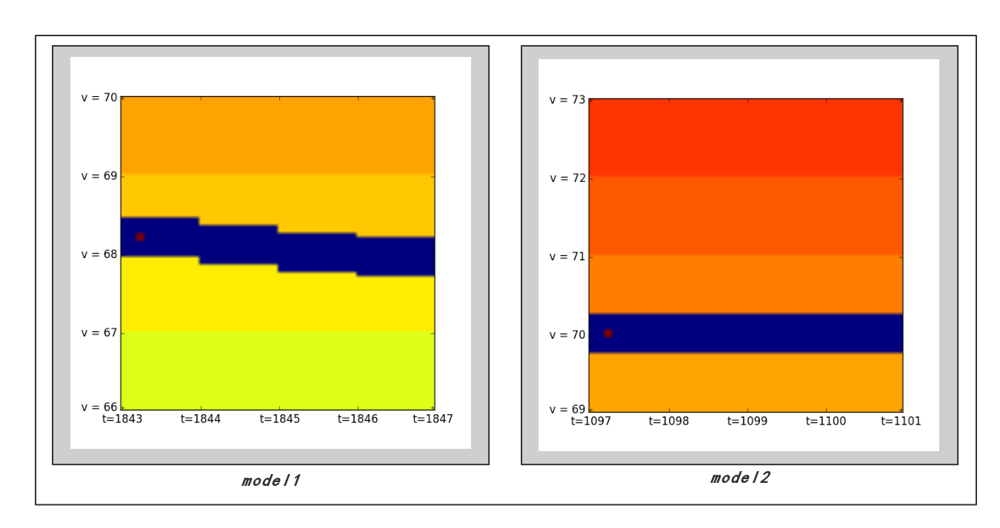
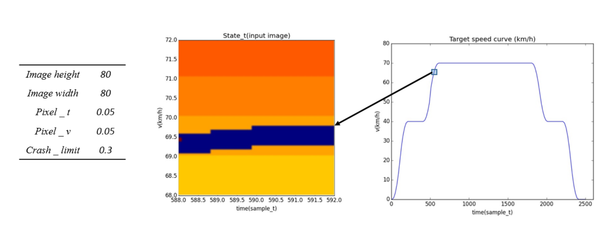
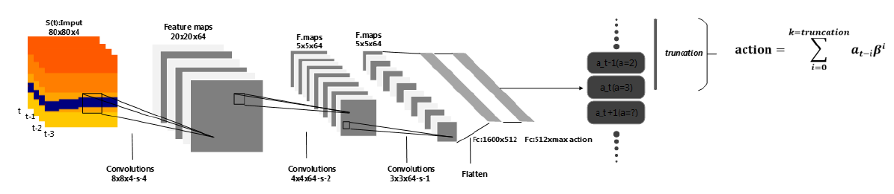
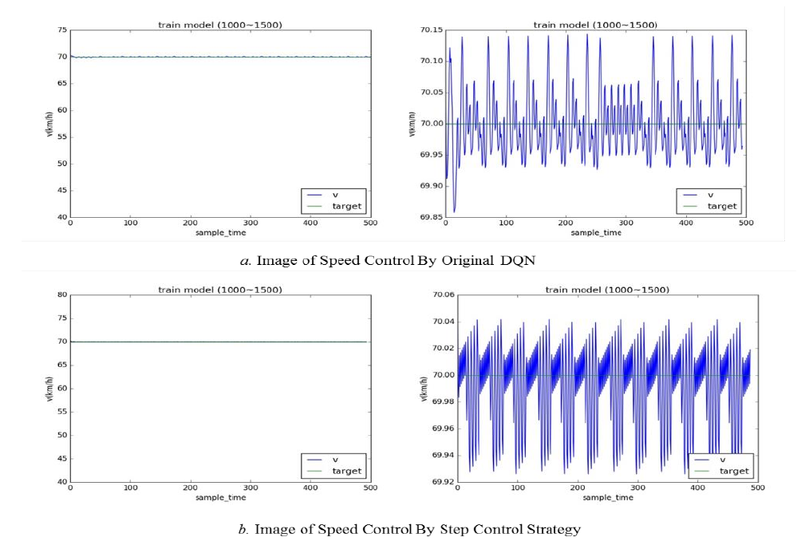
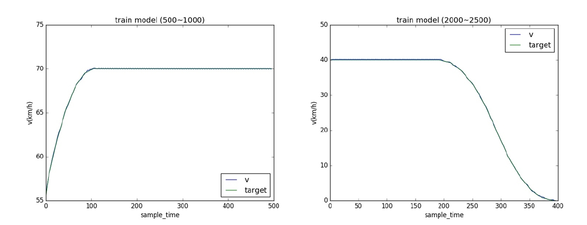

# DQN & ATO

本文档是整理一下两篇WCSE2018的论文代码 [Algorithm of Automatic Train Operation System Based on Reinforcement Learning](paper/Algorithm of Automatic Train Operation System Based on Reinforcement Learning.pdf) , [Research on DQN Algorithm with Step Control Strategy Applied in ATO](paper/Research on DQN Algorithm with Step Control Strategy Applied in ATO.pdf) 设计思路而来。两篇文章主要的工作在于将传统列车模型状态抽象为2D图像游戏，然后利用强化学习离散控制的经典的DQN算法结合ATO的模糊控制，阶梯控制等技巧尝试对列车需求的速度曲线进行控制。

内容分三个部分：

1. 问题介绍：列车模型与游戏抽象　
2. DQN简单介绍与算法实现（tensorflow）
3. 文章介绍与总结


## 列车模型与游戏抽象

#### 列车模型介绍

列车模型的抽象来源与杭州地铁数据。数据以csv格式储存，包含连续上千个采样点上的列车速度与实时牵引力的大小，这里参考女友师姐的文章（）。

文章中介绍到我们可以通过传统的系统辨识的方法。我们直接将辨识出的列车模型抽象成函数*train_model* ,定义在[*game/train_model.py*](game/train_model.py)　中。可以看到这是个分段的二次函数，通过某一时刻的列车速度和当前推力以及时刻点返回下一时刻的列车速度。



**我们的目标是在这个模型假设的基础上完成对列车模型的控制算法的实现。**

决定尝试dqn强化学习的解决方案，列车模型不再以参数化的形式出现在控制算法或者是生成控制算法的流程中。而是将列车模型抽象成一个模拟器（通过输入控制列车状态的转移）。


#### 游戏抽象

参考经典的dqn论文 [Human-level control through Deep Reinforcement Learning](https://storage.googleapis.com/deepmind-media/dqn/DQNNaturePaper.pdf) ,我们仿照电子游戏试图将列车某一采样点时刻的状态用图像表示出来，同时我们期望在这个转化的过程中保有以下的性质：

1. 图像能描述当前列车的运行状态信息（近似单射），不同的状态对应的图像不同。
2. 变换后保持有近似的等变性，相似的列车状态转换出来的图像是相似的。
3. 图像语音信息明确，在了解变换过程之后，人可以毫不费力的理解图像对应的列车状态。

我们可以把这个转换的过程，称为渲染（render）。当然一个游戏模拟器不仅仅包括渲染，还有输入输出控制，奖励机制等等。而输入输出控制与奖励机制是文章研究这种利用DQN实现控制的思想的对照实验重点。整个游戏的代码实现在 [*game/pic_game.py*](game/pic_game.py)。


#### Render过程（state2picture）

首先先看几张渲染后的图片：



不需要多余的解释我们也能看懂，render出来的画面是一张时刻速度图像。

1. 图中蓝色的区域表示了途中显示的时刻上的目标速度与可以允许的误差范围（范围越大，蓝色带越宽）。
2. 蓝色带中黑点则表示了该时刻列车的速度。(处在的时刻点和速度)
3. 不同的速度，背景颜色（数值）也是不同的。

**生成图像的过程示例和所需要的参数如下：**

##### 优点：　

​	简单明了，在一定的精度要求下，基本符合我们需求的性质（１～３）

##### 缺点：

1. 精度问题，例如v=70 与 v=70+0.5*velocity_interval_per_pixel渲染出来是完全相同
2. 表达能力，在图像大小确定的情况下与精度是矛盾的，例如精度越高，我们能展示的状态空间就越小。例如time_interval_per_pixel越大，图像在时间上所展现未来的速度需求就越少，不利于预测控制。例如velocity_interval_per_pixel越大，那么可以展示的速度范围就越小，好在列车加减速都较为平缓，所以我们的参数应该是一定trade-off后的结果。
3. 单张图片不能展示列车的二阶状态，例如列车正在加减速或者匀速等等。好在DQN的输入是由某时刻点前４个时刻的图片叠加输入的。


#### 输入控制

在把列车状态转化为图像的过程中我们就已经感受到如何将连续状态空间合理的应用到qlearning的场景下是一个非常大的问题。即使是图像也是离散的状态空间。而更为迫切的就是输入控制问题。输入变量理论上是连续的，但在dqn里，输入变量是离散的。以下两点帮助我们解决这个问题：

1. 通过统计实际列车的操作数据，我们可以发现实际的delta_u是离散的整数值，不会出现无限精度的连续值。
2. 在整个实际的列车控制当中，delta_u基本出现在几个分布最多的值上，我们可以选为输入控制的状态空间。
3. ATO的模糊控制理论。

实际上我们选取一定的控制状态，例如５～７个，涵盖正常的需求即可。（某种程度上ＡＴＯ的好坏也包含了对delta_u的限制，例如最好不要急刹车。）在我们的游戏中，我们设计为：

```python
def Game():
	actions = [-10, -5, 0, 5, 10]
```

或者是：

```python 
def Game():
  	k_action = 5
	actions_num = 5 #[-10,-5,0,5,10]
```

当然对于输入控制的状态空间我们可以合理猜测，状态空间越大越精细，最终学习的控制效果将越好，而学习过程将越困难。


#### 奖励函数

游戏的奖励函数直接决定了你的训练目标。在尝试过很多种形式的奖励函数后，我们首先选择了以下这种：

1. 对列车状态s下的执行动作a,列车状态转移到s1.如果s1状态列车速度依然保持在crash_limit以内，则获得k1的奖励。如果超过crash_limit，则获得k2的奖励（惩罚），然后重新随机开车。

这种情况的目标是是选择的动作让列车不要超速或者低速。但并不能够很好的控制车速与需求速度接近，实际学习出来的速度会在设置的可行域[v-crash_limit,v+crash_limit]内震荡。所以我们添加了如下的奖励。

2. 车速与目标速度接近至一定范围，给予额外奖励k3(abs(dv),abs(dd_v))


当然k1,k2,k3的参数都是可以设计的。

```python
def Game():  
    def _get_reward(self):
        if abs(self.d_v) > 0.3:
            reward = - 10
        elif abs(self.d_v) < 0.1:
            reward = 1.5 - 10 * abs(self.d_v) - 5 * abs(self.dd_v)
        else:
            reward = 0.2

        self.reward += reward
        return reward
```


上述所有的内容都存放在 [*game*](game) 下.


## DQN介绍与实现

首先我们将介绍Q-learning,然后介绍为什么会引入cnn和如何引入cnn。并都用代码实现出来。整个dqn算法的实现在 [dqn_train.py](dqn_train.py)　，而其中所用到tf封装的cnn inference的封装则存放在　[model/cnn.py](model/cnn.py)　中。


#### Q-learning

Q-learning是一种用在在状态跳转的游戏下获取最大收益目标的强化学习算法。

核心决策假设基于我们已经有一个对状态下的每一步动作的Q值（代表该状态下未来的期望收益）的估计，也就是Q-table.同时我们能够获取每一个动作的动作收益。这样结合下一个状态的期望收益和动作收益，选择最大收益的动作即可。

如何能够获得每一个状态下每一个动作的Q值（这种描述下是一张表Ｑ-table）。Q-learning算法就是介绍了一种迭代的（包含随机策略例如epsilon greedily）搜索算法去不断更新优化Ｑ-table.使其最终逼近决策目标系统的真实可用的Q-table. 


#### DQN

如果Q-learning算法的可转移状态太多（数量级倍的增多），我们难以维护一个Q表去实现状态转移。Q表对应的是一种函数关系。对于数量级很大的状态空间，我们采用神经网络用来拟合这个从状态到Q值变换关系。注意这个神经网络的训练过程与Q-learning的学习过程是同步的：

1. Q-learning中每一次的目标Ｑ值是由下一状态的Ｑ值计算而出的。
2. 神经网络需要标签值，可以利用目标Ｑ值作为我们的标签值。

而上面２中提到的目标Ｑ值是下一状态的Ｑ值，理解为是当前状态在上一代版本的网络输出下决策出的下一状态在当前版本的网络下的输出的Ｑ值（这一句话和代码直接相关，有点绕口）。**所以在这个学习过程中我们一直维护了两个网络，新一代网络的标签值其实就是老一代里面最接近我们策略的预测输出.**

上面的加粗部分其实描述了两个学习过程，也是DQN的巧妙之处。一个是Ｑ值向最终真实的Ｑ值迭代的学习过程，他体现了我们的游戏策略（奖励函数）；还有一个是由状态向Ｑ值学习的过程，这个部分是神经网络的监督学习完成的，学习的过程体现了输入状态的特征的提取，以及策略对特征提取的指导。至于如何实现上诉加粗部分的神经网络训练，那么比较好的方法则是建一个memory-pool去采样训练。结合到我们这个列车控制的问题上，我们直接参考文章里的配图如下


我们将搭建网络，打印输出等工作都不做细致的介绍，如果你有需要，可自行阅读修改。这里我们只放agent学习的循环的代码，如下：

```c++
def train_network(s, readout, sess):
    # def loss function
    a = tf.placeholder("float", [None, ACTIONS])
    y = tf.placeholder("float", [None])
    readout_action = tf.reduce_sum(tf.multiply(readout, a), reduction_indices=1)
    cost = tf.reduce_mean(tf.square(y - readout_action))
    train_step = tf.train.AdamOptimizer(1e-6).minimize(cost)

    # open simulator
    game = Game()
    do_nothing = np.zeros(ACTIONS)
    do_nothing[ACTIONS/2] = 1
    observation, reward, terminal = game.step(do_nothing)

    # store memory pool
    D = deque()

    # saving and loading networks
    saver = tf.train.Saver()
    sess.run(tf.global_variables_initializer())
    try:
    	checkpoint =tf.train.get_checkpoint_state('saved_networks/beta%d_version'%VERSION_NUM)
	except:
		pass
    if checkpoint and checkpoint.model_checkpoint_path:
        saver.restore(sess, checkpoint.model_checkpoint_path)
        print("Successfully loaded:", checkpoint.model_checkpoint_path)
    else:
        print("Could not find old network weights")


    # start training
    epsilon = INITIAL_EPSILON
    t = 0
    while True:
        # choose an action epsilon greedily
        readout_t = readout.eval(feed_dict={s : [observation]})[0]
        a_t = np.zeros([ACTIONS])
        if t % FRAME_PER_ACTION == 0:
            if random.random() <= epsilon:
                print("----------Random Action----------")
                a_t[random.randrange(ACTIONS)] = 1
            else:
                action_index = np.argmax(readout_t)
                a_t[action_index] = 1
        else:
            a_t[ACTIONS/2] = 1 # do nothing

        # scale down epsilon
        if epsilon > FINAL_EPSILON and t > OBSERVE:
            epsilon -= (INITIAL_EPSILON - FINAL_EPSILON) / EXPLORE

        # run the selected action and observe next state and reward
        _observation, r_t, terminal = game.step(a_t)
        if terminal:
            game = Game()

        D.append((observation, a_t, r_t, _observation, terminal))
        if len(D) > REPLAY_MEMORY:
            D.popleft()

        if t > OBSERVE:
            # sample a minibatch to train on
            minibatch = random.sample(D, BATCH)

            # get the batch variables
            s_j_batch = [d[0] for d in minibatch]
            a_batch = [d[1] for d in minibatch]
            r_batch = [d[2] for d in minibatch]
            s_j1_batch = [d[3] for d in minibatch]

            y_batch = []
            readout_j1_batch = readout.eval(feed_dict={s: s_j1_batch})
            for i in range(0, len(minibatch)):
                terminal = minibatch[i][4]
                # if terminal, only equals reward
                if terminal:
                    y_batch.append(r_batch[i])
                else:
                    y_batch.append(r_batch[i] + GAMMA * np.max(readout_j1_batch[i]))

            train_step.run(feed_dict={
                y: y_batch,
                a: a_batch,
                s: s_j_batch}
            )

        observation = _observation
        t += 1

```

到这里，基本的基于DQN设计的，对特定列车模型的控制算法生成算法已经搭建起来了。之后第二篇文章我们添加了阶梯控制，加大了控制的状态空间，提升了效果。具体的内容可以参考论文，下面放一张框图解释一下区别：



阶梯控制是列车控制算法里常用的技巧，在框图的右侧，实际上我们可以理解为扩大了列车控制的动作状态空间，使得动作更为精细，而需要决策的动作序列也更长，学习难度加大，但理论效果得以提升。在添加阶梯控制之前，算法对的控制结果存在明显难以消除的震荡，添加后消除震荡效果明显。



实际上的效果比对比图更好。同时我们可以观察一下生成的控制算法对加减速的过程控制，效果如下



基本可以稳定控制贴合需求曲线，而且在没有明显的超调（这个是什么我基本忘了，妹子说的）。

